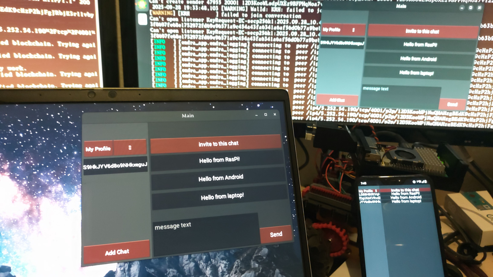

## Endra App

A P2P encrypted messenger for desktop and mobile.

Linux ⋅ Windows ⋅ Android

Endra combines Walytis' peer-to-peer distributed database, WalytisIdentities' identity & cryptography management, and WalytisOffchain's secure data storage & transmission, and WalytisMutability's database editing abstraction to form a fully featured messaging protocol.


## Features

- fully peer to peer, no servers of any kind
- can function independently of internet connectivity
- full end-to-end encryption ephemeral keys, algorithm-agnostic & future-proof
- multiple devices per profile (user account)
- multiple profiles per device
- can be used as a library for embedding into other applications
- will become part of an expandable ecosystem incl. calendar and file-sharing

#### Features Coming Soon
So far the main focus of Endra has been its foundational architecture, so until now little work has been invested in essential higher-level messaging features.
However, now is the time where some of these will start being developed and tested:
- rich text formatting (markdown as default, perhaps others too)
- inline multimedia
- file attachments with progress tracking for transmission
- take photos with camera
- scan QR-codes
- record audio with microphone
- zip-file backups

### Disadvantages

- higher resource usage on user devices compared to conventional messengers

## Usage Notes

- Patience - The app is slow to start, and the communication is not neccesarily something you'd call 'instant messaging'.
- Battery drain - On mobile devices, keep an eye on your battery level, as this app's P2P networking engine uses a fair amount of power.



## OS Compatibility & Download

The Endra application is designed to be cross-platform for desktop and mobile.
So far, it has been tested on Linux (Ubuntu 24 x86-64 & arm64), Android (arm64), Windows 11 (x86-64) and MacOS (x86-64 & arm64).

Package build pipelines have been developed for the below listed formats.
You can [download these application packages here](https://github.com/emendir/EndraApp/releases).

### Linux
- flatpak for x86-64 and arm64
- executable binary for x86-64 and arm64

Coming soon: Nix, AUR

### Android
- APK for arm64

### MacOS
- executable binary for x86-64 and arm64
- .app package for x86-64 and arm64

### iOS
probably coming later, in [Phase IV of the Endra Roadmap](../RoadMap.md#Phase%20IV%20-%20Transform%20into%20Production-Grade%20Software), unless

### Windows
- portable EXE for x86-64


## Run From Source

Install Prerequisites:

```sh
./install_prereqs.sh
pip install -r requirements.txt
pip install -r requirements-dev.txt
```

```sh
python .
```

### Environment Variables

- `USE_PANGO` (defaults to false): Use the Pango text provider to enable broader character & emoji text rendering support
- `USE_BRENTHY` (defaults to false): Instead of running an embedded IPFS and Walytis node, use the separately running system services for IPFS and Walytis. This enables faster loading times. To set up IPFS & Walytis in this way, [install Brenthy](https://github.com/emendir/BrenthyAndWalytis)
- `KIVY_NO_CONSOLELOG` (defaults to false): stop kivy logging to console

## DevOps

For speedy starting and termination of the app, on Linux, [install Brenthy](https://github.com/emendir/BrenthyAndWalytis) to run Walytis & IPFS as a systemd service.
Then run Endra with:

```sh
USE_BRENTHY=1 python tests/test_app.py
```

Pressing Ctrl+C in the terminal should promptly close the Endra app.

Rerunning the app this way overwrites the app's appdata with a cache stored in `tests/appdata`, so that it doesn't matter if the app crashes and corrupts its appdata.

To save the current appdata, close the endra app, and run:

```sh
tests/update_appdata.sh
```

From now on, every time you run `tests/test_app.py`, the new appdata state will be loaded.

To reset the appdata, run:

```sh
rm -rf tests/appdata
```

## Documentation

The thorough documentation for this project and the technologies it's based on live in a dedicated repository:

- [EndraApp](https://github.com/emendir/WalytisTechnologies/blob/master/EndraApp/1-IntroToEndraApp.md): learn how EndraApp works
- [Walytis Technologies](https://github.com/emendir/WalytisTechnologies): learn about the suite of tools which EndraApp is part of, built to enable developers to easily develop peer-to-peer distributed applications.

## Project Status **EXPERIMENTAL**

This library is very early in its development.

The API of this library IS LIKELY TO CHANGE in the near future!

## [RoadMap](https://github.com/emendir/WalytisTechnologies/blob/master/RoadMap.md)

See the [Walytis Technologies RoadMap](https://github.com/emendir/WalytisTechnologies/blob/master/RoadMap.md) for the current plans for EndraApp in the context of the larger [Walytis Technologies Project](https://github.com/emendir/WalytisTechnologies).

## Contributing

### Get Involved

- GitHub Discussions: if you want to share ideas
- GitHub Issues: if you find bugs, other issues, or would like to submit feature requests
- GitHub Merge Requests: if you think you know what you're doing, you're very welcome!

### Financial Support

To support me in my work on this and other projects, you can make donations with the following currencies:

- **Bitcoin:** `BC1Q45QEE6YTNGRC5TSZ42ZL3MWV8798ZEF70H2DG0`
- **Ethereum:** `0xA32C3bBC2106C986317f202B3aa8eBc3063323D4`
- [**Fiat** (via Credit or Debit Card, Apple Pay, Google Pay, Revolut Pay)](https://checkout.revolut.com/pay/4e4d24de-26cf-4e7d-9e84-ede89ec67f32)

Donations help me:
- dedicate more time to developing and maintaining open-source projects
- cover costs for IT infrastructure
- finance projects requiring additional hardware & compute

## About the Developer

This project is developed by a human one-man team, publishing under the name _Emendir_.  
I build open technologies trying to improve our world;
learning, working and sharing under the principle:

> _Freely I have received, freely I give._

Feel welcome to join in with code contributions, discussions, ideas and more!

## Open-Source in the Public Domain

I dedicate this project to the public domain.
It is open source and free to use, share, modify, and build upon without restrictions or conditions.

I make no patent or trademark claims over this project.  

Formally, you may use this project under either the: 
- [MIT No Attribution (MIT-0)](https://choosealicense.com/licenses/mit-0/) or
- [Creative Commons Zero (CC0)](https://choosealicense.com/licenses/cc0-1.0/)
licence at your choice.  

## Related Projects

### [Walytis Technologies](https://github.com/emendir/WalytisTechnologies)

An overarching project comprising the development of Walytis and a collection of tools based on it for real-world peer-to-peer communications.

- [Walytis](https://github.com/emendir/Walytis_Beta): A flexible, lightweight, nonlinear database-blockchain, built on IPFS.
- [WalytisIdentities](https://github.com/emendir/WalytisIdentities): P2P multi-controller cryptographic identity management, built on Walytis.
- [WalytisOffchain](https://github.com/emendir/WalytisOffchain): Secure access-controlled database-blockchain, built on WalytisIdentities.
- [WalytisMutability](https://github.com/emendir/WalytisMutability): A Walytis blockchain overlay featuring block mutability.
- [Endra](https://github.com/emendir/Endra): A P2P encrypted messaging protocol with multiple devices per user, built on Walytis.
- [EndraApp](https://github.com/emendir/EndraApp): A P2P encrypted messenger supporting multiple devices per user, built on Walytis.

### [IPFS](https://ipfs.tech)

A P2P communication and content addressing protocol developed by Protocol Labs.
This is the networking foundation which Walytis builds upon.

### Alternative Technologies

- [Berty](https://berty.tech/messenger): a P2P messenger for mobile phones built on [IPFS](https://ipfs.tech) & [OrbitDB](https://orbitdb.org/)

